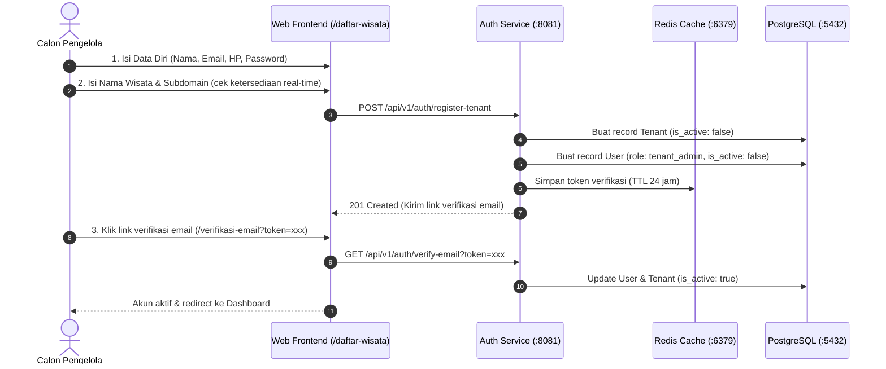
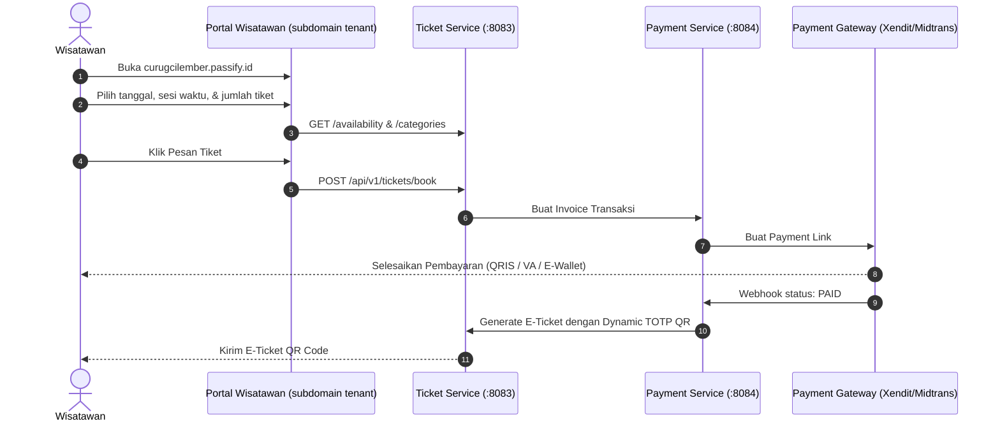

# 🌲 KONSEP & ARSITEKTUR PROYEK PASSIFY
### *White-Label Nature Tourism E-Ticketing SaaS Platform*

---

## 📌 1. Definisi & Visi Produk

**Passify** adalah platform **SaaS (Software-as-a-Service) E-Ticketing Wisata Alam berbasis White-Label (Multi-Tenant)** yang dirancang khusus untuk pengelola kawasan wisata alam (Taman Nasional, Hutan Lindung, Curug/Air Terjun, Danau, Kawasan Konservasi, BUMDes Wisata, dan Koperasi Wisata).

### 🎯 Prinsip Utama White-Label:
> **"Pengunjung datang ke destinasi wisata Anda, bukan ke platform Passify."**

- Setiap pengelola wisata (Tenant) mendapatkan **portal reservasi mandiri** dengan identitas branding mereka sendiri (Logo, Warna Tema, Favicon, dan Subdomain khusus seperti `curugcilember.passify.id` atau custom domain `tiket.curugcilember.com`).
- **PENTING:** Portal wisatawan di domain tenant **HANYA menampilkan destinasi dan tiket milik pengelola tersebut**, bukan marketplace katalog yang mencampurkan banyak wisata pihak lain.

---

## 🏛️ 2. Struktur Domain & Akses Portal

| Domain / URL | Tampilan / Fungsi | Target Pengguna |
| :--- | :--- | :--- |
| **Root Domain** (`passify.id` / `localhost:5173`) | **SaaS Landing Page & Marketing**<br>• Penjelasan fitur & produk Passify<br>• Pendaftaran Pengelola Mandiri (`/daftar-wisata`)<br>• Verifikasi Email Akun (`/verifikasi-email`)<br>• Showcase Demo Portal (`/jelajah`) | Publik / Calon Pengelola Wisata |
| **Tenant Subdomain** (`[slug].passify.id`) | **Portal Tiket Wisatawan Mandiri**<br>• **Hanya menampilkan 1 tempat wisata milik tenant ini**<br>• Pemilihan tanggal kunjungan & sesi waktu (Time Slot)<br>• Pengecekan sisa kuota daya tampung (Carrying Capacity)<br>• Booking tiket & pembayaran online | Wisatawan / Pengunjung |
| **Tenant Dashboard** (`[slug].passify.id/admin`) | **Dashboard Operasional Tenant**<br>• Manajemen jenis & harga tiket (Domestik, Mancanegara, dll)<br>• Pengaturan kuota harian & time slots<br>• Manajemen scanner gerbang (Gate Device)<br>• Keuangan, laporan penjualan, & pencairan dana (*payout*) | Tenant Admin & Staff |

---

## 👥 3. Peran Pengguna (User Roles)

1. **`super_admin` (Platform Operator):**
   - Mengelola seluruh ekosistem platform Passify.
   - Memantau performa seluruh tenant.
   - Mengatur konfigurasi global dan komisi *platform fee* per tiket.
2. **`tenant_admin` (Pengelola Wisata Utama):**
   - Mendaftar secara mandiri melalui form onboarding.
   - Mengatur profil wisata, foto galeri, fasilitas, dan rekening bank.
   - Mengelola jenis tiket, kuota harian, sesi waktu kunjungan, dan gerbang scanner.
   - Mengajukan pencairan dana (*payout*) dari hasil penjualan tiket.
3. **`tenant_staff` (Staf Lapangan Tenant):**
   - Membantu operasional harian, mengelola stan/booth vendor di area wisata.
4. **`gate_officer` (Petugas Gerbang):**
   - Menggunakan aplikasi pemindai QR untuk validasi tiket wisatawan (siap mode online & offline).
5. **`vendor` (Pelaku Usaha di Kawasan Wisata):**
   - Mengoperasikan stan F&B, penyewaan alat camping, suvenir dengan pembayaran dompet digital (*cashless wallet*).
6. **`visitor` (Wisatawan/Pengunjung):**
   - Memilih tanggal & sesi kunjungan, memesan tiket, menerima Dynamic TOTP QR E-Ticket, dan melakukan top-up dompet cashless.

---

## 🔄 4. Alur Bisnis Utama (Core Workflows)

### A. Pendaftaran Tenant Mandiri (Self-Service Onboarding)


---

### B. Pemesanan & Pembelian Tiket oleh Wisatawan


---

### C. Validasi Tiket di Pintu Masuk (Gate Service)
1. **Online Mode:** Petugas memindai QR code tiket $\rightarrow$ Gate Service mencocokkan kode HMAC & waktu sesi $\rightarrow$ Tiket ditandai *Used*.
2. **Offline Mode:** Perangkat scanner mengunduh manifest tiket terenkripsi di pagi hari. Saat tidak ada sinyal internet, perangkat tetap dapat memverifikasi keaslian Dynamic QR secara lokal dan menyinkronkan data kembali saat sinyal pulih.

---

## 💻 5. Arsitektur Teknis Backend & Port Layanan

```
passify/
├── cmd/
│   ├── auth-service/main.go      (:8081) → Autentikasi, JWT, Profil, Self-Register Tenant
│   ├── tenant-service/main.go    (:8082) → Organisasi Tenant, Destinasi Wisata, Setting Branding
│   ├── ticket-service/main.go    (:8083) → Kategori Tiket, Kuota Harian, Time Slot, Booking E-Ticket
│   ├── payment-service/main.go   (:8084) → Invoice Gateway, Webhook Pembayaran, Payout Tenant
│   ├── cashless-service/main.go  (:8085) → Digital Wallet, Top Up, Booth Vendor, Transaksi F&B
│   └── gate-service/main.go      (:8086) → Device Scanner, Validasi Dynamic QR, Offline Sync
│
├── internal/
│   ├── config/                   → Konfigurasi environment (.env)
│   ├── database/                 → PostgreSQL GORM & Redis client
│   ├── middleware/               → CORS, JWT Authentication, Role Check
│   ├── models/                   → Definisi Struct Database (GORM)
│   └── response/                 → Standard JSON Response Formatter
│
└── frontend/                     → React + Vite + Tailwind CSS (SPA)
```

---

## 🛡️ 6. Ketentuan Pengembangan (Development Guidelines)

1. **Jaga Konsep Single-Destinasi per Subdomain:** Jangan pernah menampilkan daftar campuran destinasi milik tenant lain di dalam portal subdomain tenant.
2. **Keamanan Dynamic QR:** Setiap e-ticket menggunakan TOTP + HMAC payload rahasia untuk mencegah pemalsuan dan tangkapan layar (screenshot sharing).
3. **Pemisahan Dana Transaksi:** Setiap transaksi mencatat `Platform Fee` (komisi platform) dan `Net Payout Amount` (hak bersih tenant) secara transparan untuk memudahkan rekonsiliasi keuangan.
