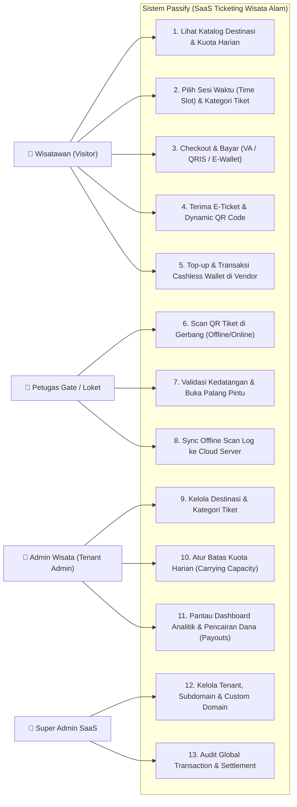
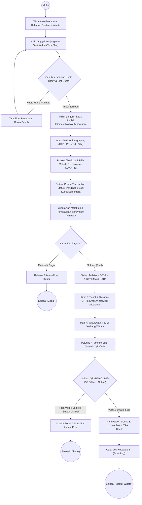
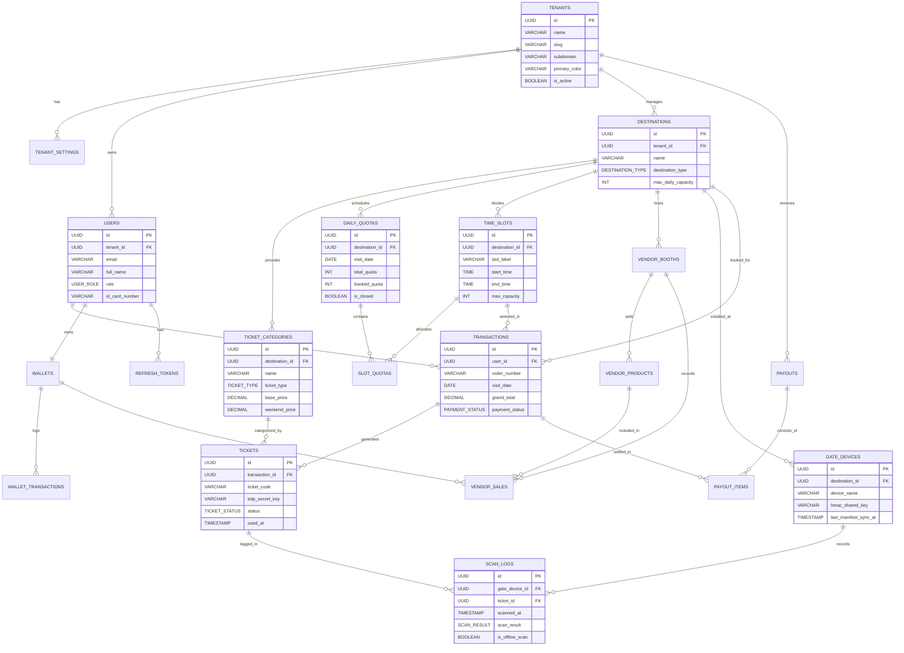
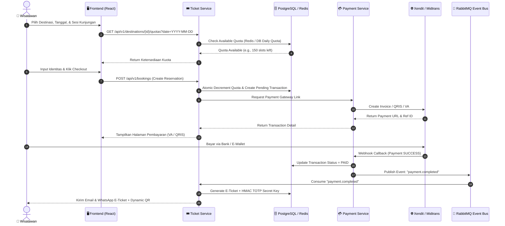
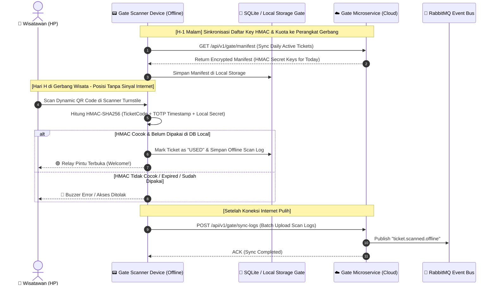
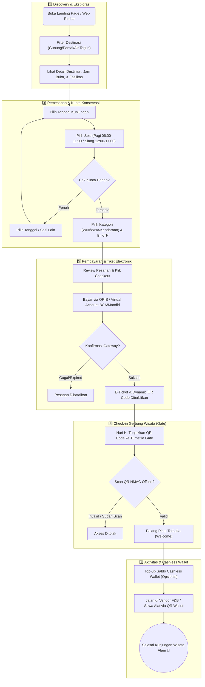

# UML & Architecture Diagrams — Passify (White-label Ticketing Wisata Alam)

Dokumen ini berisi dokumentasi **UML (Unified Modeling Language)** dan alur sistem lengkap untuk proyek **Passify**, sebuah platform SaaS Ticketing Wisata Alam dengan dukungan *Multi-Tenant*, *Carrying Capacity Management*, dan *Offline Dynamic QR Gate Validation*.

---

## 1. Use Case Diagram
Diagram berikut menggambarkan aktor-aktor yang terlibat dalam sistem Passify serta interaksi mereka dengan fitur-fitur utama platform.

> [!NOTE]
> **Aktor Utama:**
> 1. **Wisatawan (`visitor`):** Pengguna akhir yang memesan tiket, membayar secara online, dan menggunakan QR Code di gerbang masuk.
> 2. **Petugas Gate (`gate_officer`):** Mengoperasikan perangkat scanner (loket/turnstile) yang mendukung pemindai QR offline via HMAC.
> 3. **Admin Wisata (`tenant_admin`):** Pengelola tempat wisata yang mengatur kapasitas kuota, harga tiket liburan/weekend, serta memantau laporan pendapatan.
> 4. **Super Admin (`super_admin`):** Pengelola platform SaaS Passify yang mengatur isolasi tenant dan settlement pencairan dana.

---

## 2. Activity Diagram (Pemesanan & Check-in Tiket Wisata)
Diagram aktivitas (*Activity Diagram*) berikut menjelaskan alur logis dari proses pemilihan destinasi, pengecekan kuota konservasi (*carrying capacity*), pembayaran, hingga pemindai tiket di pintu masuk.

---

## 3. Entity-Relationship Diagram (ERD)
Berdasarkan skema migrasi database resmi (`000001_initial_schema.up.sql`), database Passify menggunakan **PostgreSQL 16** dengan arsitektur **Multi-Tenant (Row-Level Security / RLS)**. Berikut adalah pemetaan 17 tabel entitas beserta relasinya:

> [!IMPORTANT]
> **Keamanan Multi-Tenant (RLS):**
> Setiap tabel operasional memiliki kolom `tenant_id` dan dilindungi oleh kebijakan PostgreSQL Row-Level Security (`current_setting('app.current_tenant_id')`), menjamin data antar pengelola wisata tidak dapat saling bocor.

---

## 4. Sequence Diagram
Berikut adalah dua *Sequence Diagram* utama yang menunjukkan komunikasi antar mikroservis (Golang/Gin, PostgreSQL, Redis, RabbitMQ, dan Hardware Gate):

### A. Sequence Pembelian & Penerbitan Tiket (Online Booking)

### B. Sequence Offline Gate Validation (Tanpa Internet di Area Gunung / Hutan)

---

## 5. User Flow Diagram (End-to-End User Journey)
Diagram alur pengguna (*User Flow*) ini menunjukkan seluruh perjalanan pengguna dari awal mengeksplorasi destinasi alam hingga selesai menikmati fasilitas di dalam area wisata.

---

## 6. Ringkasan Fitur yang Pemetaannya Ada dalam UML
1. **White-label Multi-Tenant:** Terlihat di ERD melalui isolasi `tenant_id` pada seluruh tabel dengan kebijakan *Row-Level Security (RLS)*.
2. **Carrying Capacity / Quota:** Terkontrol pada tabel `daily_quotas` & `time_slots`, dilindungi dari *overbooking* saat Activity & Sequence Booking.
3. **Dynamic QR & Offline Gate:** Tergambarkan pada Sequence Diagram B di mana validasi HMAC-SHA256 dilakukan lokal oleh perangkat gate tanpa ketergantungan sinyal internet.
4. **Cashless Wallet:** Terhubung pada ERD (`wallets`, `wallet_transactions`, dan `vendor_sales`) untuk transaksi dalam kawasan wisata.
5. **Settlement & Payouts:** Terintegrasi pada tabel `payouts` & `payout_items` untuk pembagian pendapatan transparan bagi pengelola wisata.
